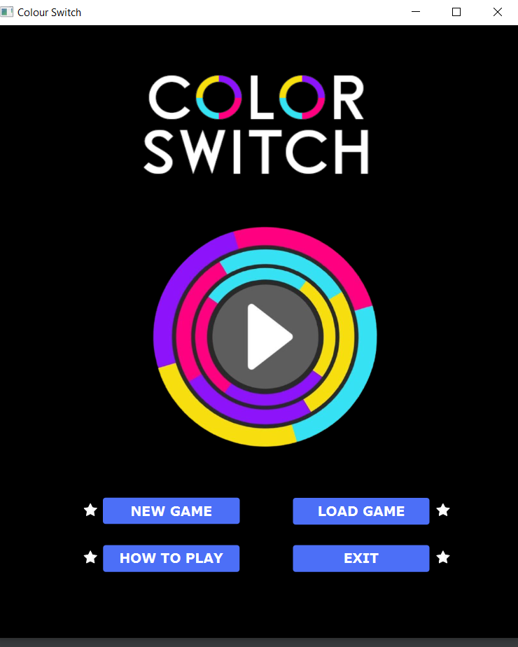
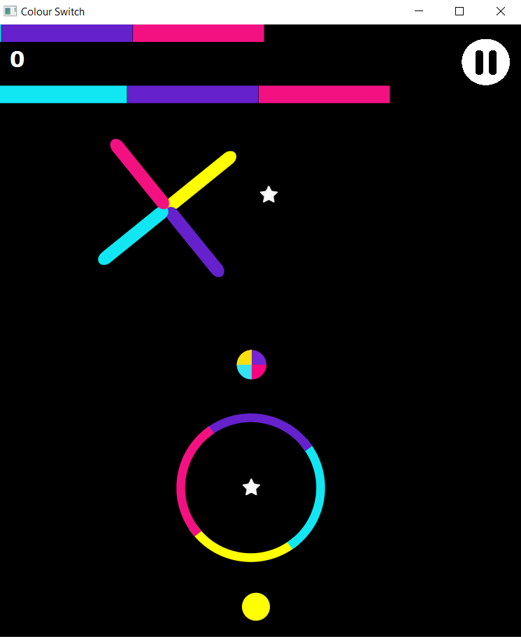
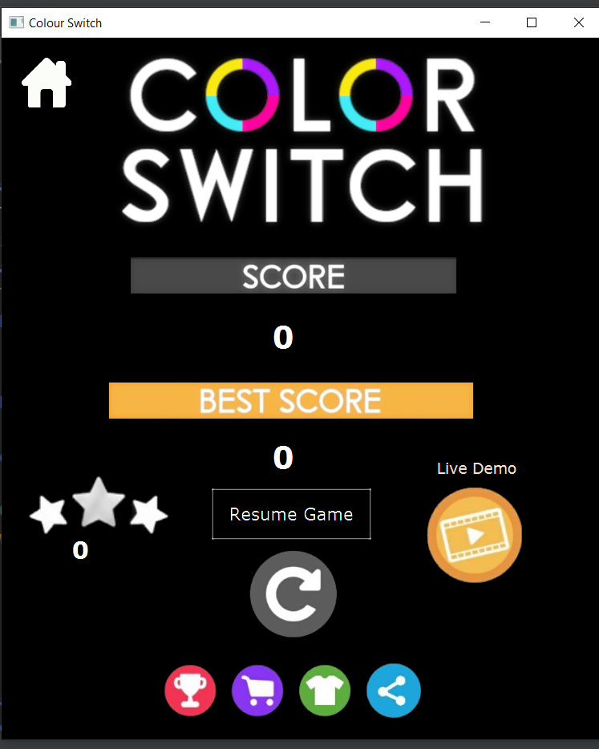

# Colour Switch


## Details:
Created by Harshita Srinivas and Aditi Sejal

This is a clone of the strategy game :video_game: , Colour Switch originally developed by Pheonix Games

Made as a part of project in Advanced Programming course at IIIT-Delhi.

Uses Java and JavaFx.

## Features:
1. Game :video_game: progresses in infite display with increasing difficulty
1. In-Game upgrades available (Clover and Rocket) that boosts score on gameplay
1. Implementation of Bonus Shop feature to buy upgrades and costum balls
1. In game assets:
  1. Obstacles Available :red_circle:: Cross, Line, Triangle, Circle and Rectangle
  1. Balls Available :softball:: Normal Ball, Ice Ball, Fire ball, Pink Ball, Green-light Ball
  1. How To Play :page_facing_up:: Displays details of Game Play
  1. Rocket and Clover :four_leaf_clover:: Upgrades for score boost
1. Save Game and Restart Game options: User can save multiple game states, and reload them.
1. Background Music :speaker: for cooler interactions

## Design Patterns:
1. Singleton
2. Iterator
3. Facade

## Code and assets:
1. Path to images: ```ColourSwitch/src/```
1. Path to code:```ColourSwitch/src/assests```

## Screenshots from the Game:
   

   

